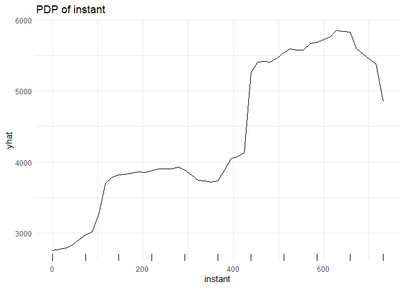
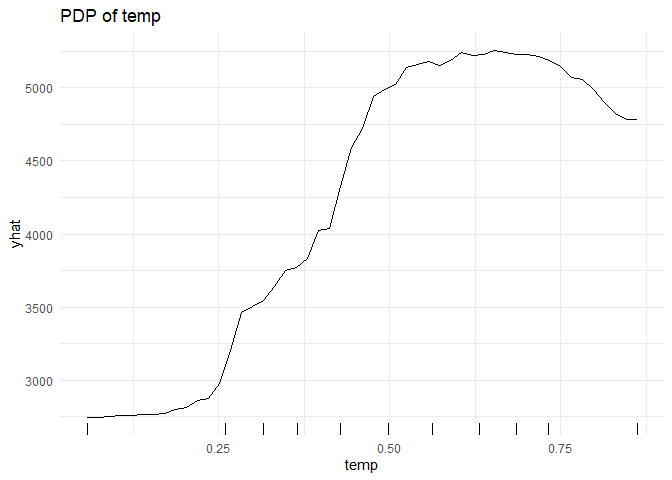
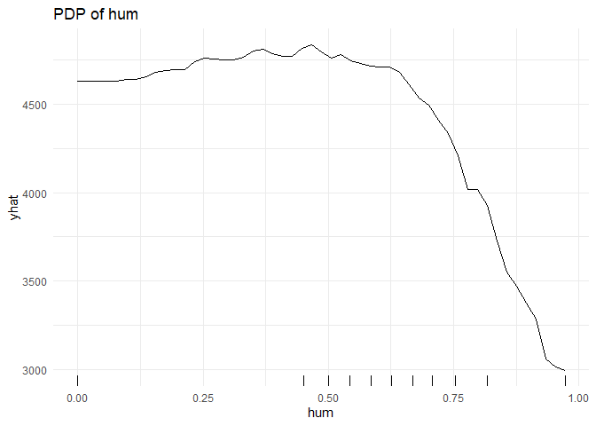
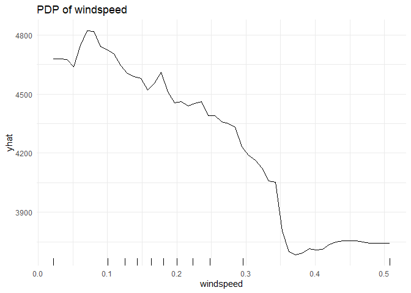
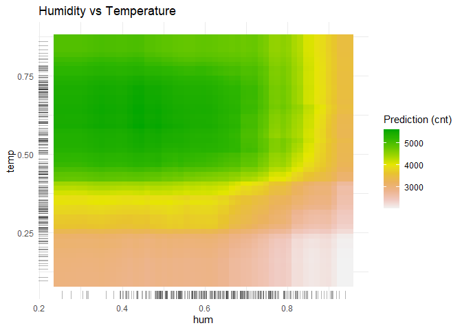
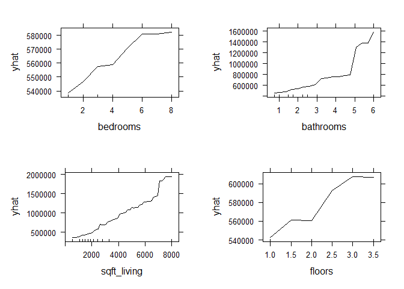
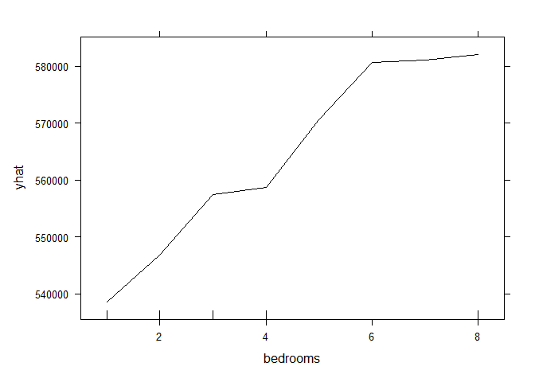
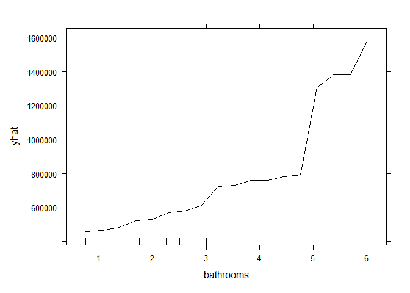
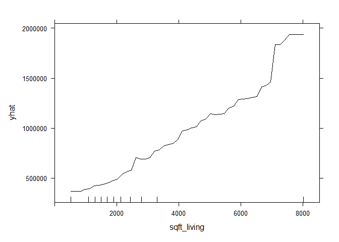
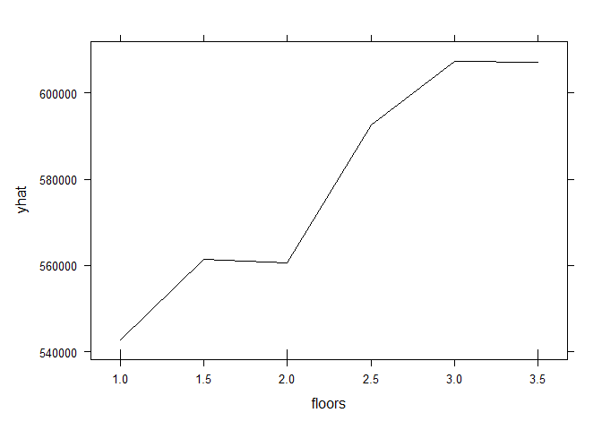

EDM Practica 5
================
Sergio
2026-05-10

## R Markdown

This is an R Markdown document. Markdown is a simple formatting syntax
for authoring HTML, PDF, and MS Word documents. For more details on
using R Markdown see <http://rmarkdown.rstudio.com>.

When you click the **Knit** button a document will be generated that
includes both content as well as the output of any embedded R code
chunks within the document. You can embed an R code chunk like this:

``` r
library(randomForest)
```

    ## Warning: package 'randomForest' was built under R version 4.4.3

    ## randomForest 4.7-1.2

    ## Type rfNews() to see new features/changes/bug fixes.

``` r
library(pdp)
```

    ## Warning: package 'pdp' was built under R version 4.4.3

``` r
library(ggplot2)
```

    ## Warning: package 'ggplot2' was built under R version 4.4.3

    ## 
    ## Adjuntando el paquete: 'ggplot2'

    ## The following object is masked from 'package:randomForest':
    ## 
    ##     margin

``` r
bike <- read.csv("day.csv")


set.seed(123)
rf_bike <- randomForest(cnt ~ instant + temp + hum + windspeed, data = bike)

features <- c("instant", "temp", "hum", "windspeed")
pdp_plots <- list()

for(f in features) {
  pdp_plots[[f]] <- partial(rf_bike, pred.var = f, plot = TRUE, rug = TRUE, 
                            plot.engine = "ggplot2") + 
                    ggtitle(paste("PDP of", f)) + 
                    theme_minimal()
}

pdp_plots$instant
```

<!-- -->

``` r
pdp_plots$temp
```

<!-- -->

``` r
pdp_plots$hum
```

<!-- -->

``` r
pdp_plots$windspeed
```

<!-- -->

``` r
set.seed(42)
bike_sample <- bike[sample(nrow(bike), 300), ]

pd_2d <- partial(rf_bike, pred.var = c("hum", "temp"), train = bike_sample)

ggplot(pd_2d, aes(x = hum, y = temp, fill = yhat)) +
  geom_tile(width = 0.04, height = 0.04) + 
  scale_fill_gradientn(colours = rev(terrain.colors(10))) +
  geom_rug(data = bike_sample, aes(x = hum, y = temp), inherit.aes = FALSE, alpha = 0.3) +
  labs(title = "Humidity vs Temperature",
       fill = "Prediction (cnt)") +
  theme_minimal()
```

<!-- -->

``` r
library(randomForest)
library(pdp)
library(ggplot2)
library(dplyr)
```

    ## Warning: package 'dplyr' was built under R version 4.4.3

    ## 
    ## Adjuntando el paquete: 'dplyr'

    ## The following object is masked from 'package:randomForest':
    ## 
    ##     combine

    ## The following objects are masked from 'package:stats':
    ## 
    ##     filter, lag

    ## The following objects are masked from 'package:base':
    ## 
    ##     intersect, setdiff, setequal, union

``` r
library(readr)
```

    ## Warning: package 'readr' was built under R version 4.4.3

``` r
library(gridExtra)
```

    ## 
    ## Adjuntando el paquete: 'gridExtra'

    ## The following object is masked from 'package:dplyr':
    ## 
    ##     combine

    ## The following object is masked from 'package:randomForest':
    ## 
    ##     combine

``` r
houses <- read.csv("kc_house_data.csv")

set.seed(123)
houses_sample <- houses[sample(nrow(houses), 1000), ]

rf_kc <- randomForest(price ~ bedrooms + bathrooms + sqft_living + sqft_lot + floors + yr_built, 
                      data = houses_sample)

p_bed <- partial(rf_kc, pred.var = "bedrooms", plot = TRUE, rug = TRUE)
p_bath <- partial(rf_kc, pred.var = "bathrooms", plot = TRUE, rug = TRUE)
p_sqft <- partial(rf_kc, pred.var = "sqft_living", plot = TRUE, rug = TRUE)
p_floors <- partial(rf_kc, pred.var = "floors", plot = TRUE, rug = TRUE)
grid.arrange(p_bed, p_bath, p_sqft, p_floors, ncol = 2)
```

<!-- -->

``` r
p_bed
```

<!-- -->

``` r
p_bath
```

<!-- -->

``` r
p_sqft
```

<!-- -->

``` r
p_floors
```

<!-- -->
